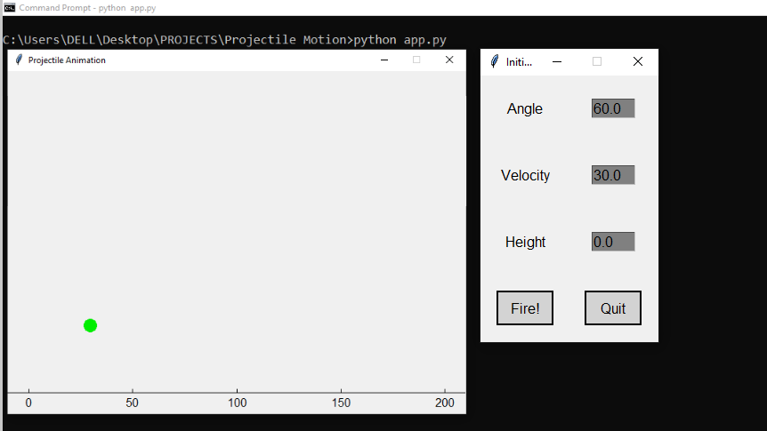

# Projectile



A graphical user interface (GUI) app in Python for simulating and visualizing the projectile motion of an object.
Enter parameters like velocity, height, and angle to see the path of the projectile.

## Features

- Simulate and visualize projectile motion.
- Customize initial parameters like velocity, height, and angle.
- Observe the trajectory and landing point of the projectile.

## Getting Started

These instructions will help you get a copy of the project up and running on your local machine.

### Prerequisites

To run this project, you'll need:

- Python3.x (3.9 recommended) installed on your system.

### Installation

1. Clone the repository to your local machine:

   ```bash
   git clone https://github.com/farookie007/Projectile.git

   ```

2. Navigate to the project directory:

   ```bash
   cd Projectile

   ```

3. Run the simulator:

   ```bash
   python app.py
   ```

## Usage

To use the Projectile Motion Simulator:

1. Launch the app by running `python app.py`.
2. Input the initial parameters for the projectile motion: velocity, height, and angle.
3. Click the "Fire" button to visualize the projectile motion.
4. Observe the trajectory and landing point displayed on the graph.
5. Click "Quit" button anytime to cancel and quit the app.

## License

This project is licensed under the GNU GENERAL PUBLIC LICENSE - see the [LICENSE.md](LICENSE.md) file for details.

## Acknowledgments

- Inspired by the physics of the projectile motion.
- Thanks to John Zelle's [Python Programming: An Introduction to Computer Science](https://books.google.com.ng/books/about/Python_Programming.html?id=aJQILlLxRmAC&redir_esc=y) for providing the GUI library.
